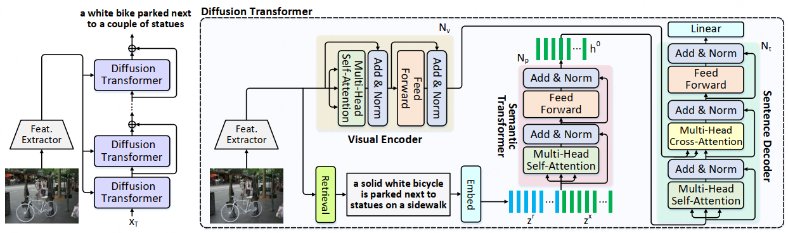

# Semantic-Conditional Diffusion Networks for Image Captioning [CVPR2023]

## Introduction
This is the official repository for [**Semantic-Conditional Diffusion Networks for Image Captioning**](https://openaccess.thecvf.com/content/CVPR2023/papers/Luo_Semantic-Conditional_Diffusion_Networks_for_Image_Captioning_CVPR_2023_paper.pdf)(SCD-Net). SCD-Net is a cascaded diffusion captioning model with a novel semantic-conditional diffusion process that upgrades conventional diffusion model with additional semantic prior. A novel guided self-critical sequence training strategy is further devised to stabilize and boost the diffusion process. 

To our best knowledge, SCD-Net is the first diffusion-based captioning model that achieves better performance than the naive auto-regressive transformer captioning model **conditioned on the same visual features(i.e. [bottom-up attention region features](https://github.com/peteanderson80/bottom-up-attention)) in both XE and RL training stages.** SCD-Net is also **the first diffusion-based captioning model that adopts CIDEr-D optimization successfully** via a novel guided self-critical sequence training strategy. 

SCD-Net achieves state-of-the-art performance among non-autoregressive/diffusion captioning models and comparable performance aginst the state-of-the-art autoregressive captioning models, which indicates the promising potential of using diffusion models in the challenging image captioning task.

## Framework


## Data Preparation

1. Download training misc data([Google Drive](https://drive.google.com/file/d/1hgjlrmfFqzx6ipFxIc0DQ98ZJiGf0ggc/view?usp=share_link), [BaiduYun](https://pan.baidu.com/s/1cl6vqEuJaQxTnf87f7zdbQ), extract code: `6os2`) for SCD-Net, and extract it in `open_source_dataset/mscoco_dataset/` folder.
2. Download official [Bottom-up features(10 to 100 regions)](https://github.com/peteanderson80/bottom-up-attention) and preprocess them.

```bash
python tools/create_feats.py --infeats karpathy_train_resnet101_faster_rcnn_genome.tsv.0 --outfolder ../open_source_dataset/mscoco_dataset/features/up_down
```

## Training
Since SCD-Net is a cascaded diffusion captioning model, we need to train stage1 and stage2 model sequentially.

```bash
# Train stage1 XE
bash configs/image_caption/scdnet/stage1/1_train_xe.sh

# Train stage1 RL
bash configs/image_caption/scdnet/stage1/2_train_rl.sh

# Inference sentences for training images using stage1 xe model in order to train stage2 XE
bash configs/image_caption/scdnet/stage1/3_xe_inf_train.sh

# Inference sentences for training images using stage1 rl model in order to train stage2 RL
bash configs/image_caption/scdnet/stage1/4_rl_inf_train.sh

# Train stage2 XE
bash configs/image_caption/scdnet/stage2/1_train_xe.sh

# Train stage2 RL
bash configs/image_caption/scdnet/stage2/2_train_rl.sh

# Inference sentences for training images using stage2 rl model and update better guided sentences
bash configs/image_caption/scdnet/stage2/3_rl_inf_train.sh
cd tools/update_kd_sents
python compare_merge.py --last_kd {path_to_autoregressive_teacher_pred_ep25.pkl} --new_pred {path_to_stage2_rl_infernece_train} --out {path_to_updated_sentences}

# Train stage2 RL with updated guided sentences
bash configs/image_caption/scdnet/stage2/4_train_rl_update_kd.sh

```

## Inference
We have released our models in `models.zip`. To reproduce the results reported in Table 1 of the paper, please place the `models` directory in the root of the repository and run the following command:

```bash
bash configs/image_caption/scdnet/stage2/5_inference_example.sh
```

For more details, refer to the script mentioned above.


## Citation
If you use the code or models for your research, please cite:

```
@inproceedings{luo2023semantic,
  title={Semantic-conditional diffusion networks for image captioning},
  author={Luo, Jianjie and Li, Yehao and Pan, Yingwei and Yao, Ting and Feng, Jianlin and Chao, Hongyang and Mei, Tao},
  booktitle={Proceedings of the IEEE/CVF Conference on Computer Vision and Pattern Recognition},
  pages={23359--23368},
  year={2023}
}
```

## Acknowledgement
This code used resources from [X-Modaler Codebase](https://github.com/YehLi/xmodaler) and [bit-diffusion code](https://github.com/lucidrains/bit-diffusion). We thank the authors for open-sourcing their awesome projects.

## License

MIT
